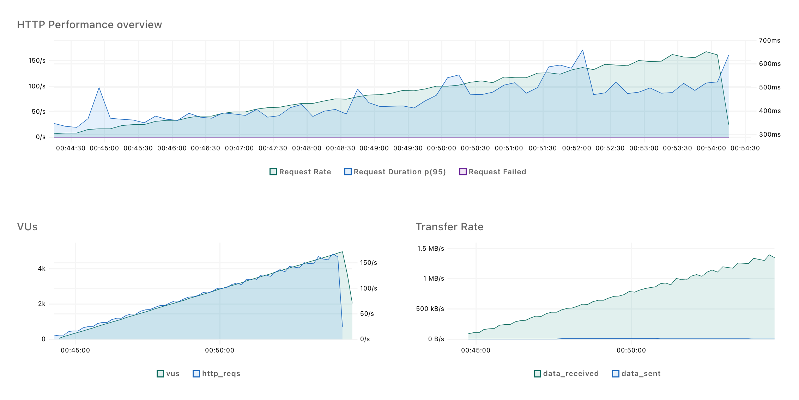

# Mautic Chart

  

## Usage

Visit [https://audacioustux.github.io/mautic-chart](https://audacioustux.github.io/mautic-chart) for more information.

Container Images are available at [hub.docker.com](https://hub.docker.com/repository/docker/tanjim/mautic/general)

## Benchmark

K6 Script and report is available in the `misc` directory.

<!-- embed misc/mautic-lt-ramp.png -->

## TODO

- [ ] Add GitHub Actions for Container Image Release
- [ ] Add GitHub Actions for Helm Chart Testing
- [ ] Add automated Helm chart documentation generation
- [ ] Add Kubernetes CronJob for Mautic Cron Jobs
- [ ] Cache var/tmp and var/cache directories for all pods
    - Tested with nfs/efs - too slow (need to retest)
- [ ] Create chart and container image for every Mautic release
    - Including dev channel
- [ ] Cleanup / Refactor